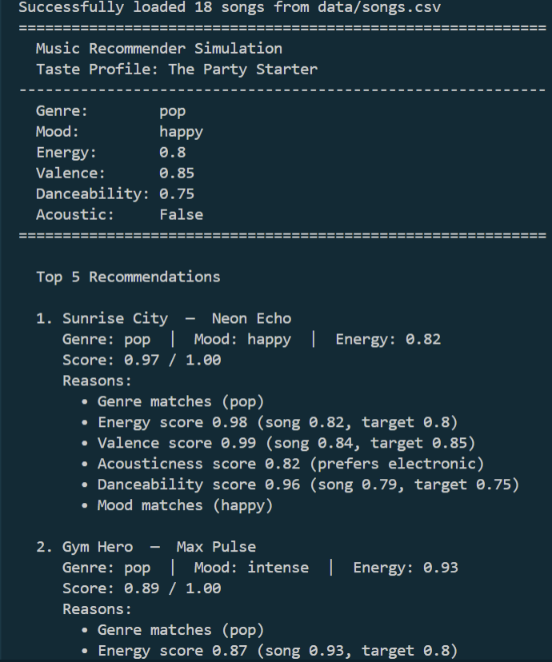
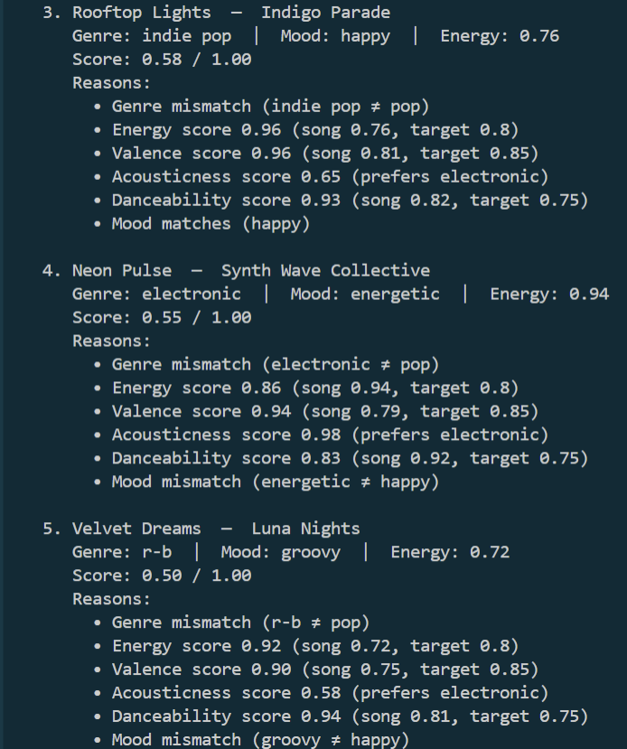

# 🎵 Music Recommender Simulation

## Project Summary

In this project you will build and explain a small music recommender system.

Your goal is to:

- Represent songs and a user "taste profile" as data
- Design a scoring rule that turns that data into recommendations
- Evaluate what your system gets right and wrong
- Reflect on how this mirrors real world AI recommenders

Replace this paragraph with your own summary of what your version does.

---

## How The System Works

Explain your design in plain language.

Some prompts to answer:

- What features does each `Song` use in your system
   - For example: genre, mood, energy, tempo
- What information does your `UserProfile` store
- How does your `Recommender` compute a score for each song
- How do you choose which songs to recommend

In this system, I are using genre, mood, energy, valence, danceability, acousticness for scoring. I am not using tempo because I thought it's already closely related to energy. Also, title, artist, and ID are also not used for scoring but for display and identification.

UserProfile store their favorite genre, their favorite mood, their target energy level and whethher they prefer acoustic or electronic instruments.

If the song matches the user's favorite genre, we give it the highest point (1 point). Next, we calculate how close the song's energy level to the user's target energy. An exact match gets 1 point, and the score decreases based on the distance.

Formula: 1 - (|target - song_value|)

We also score acousticness by checking if the song aligns with the user's preference. Song with high acousticness scores higher. Lastly, we check if the song's mood matches the user's favorite moode. Each of this six scores is then multiplies by a weight of each features:

| Features     | Weight |
| ------------ | ------ |
| Genre        | 35%    |
| Energy       | 20%    |
| Valence      | 20%    |
| Acousticness | 15%    |
| Danceability | 5%     |
| Mood         | 5%     |

Adding all these weighted scores together gives us final recomendation score between 0 and 1 for each song.

Once we scored every song, we sort all songs from highest to lowest score and return the top 5 or how many songs the user requested.

### Algorithm Recipe

My algorithms scores each feature independently.

Does the song's genre matches user's favorite genre?

- Yes: 1.0
- No: 0.0

How close the song's energy to the user's target energy?

- Formula: 1 - (|target_energy - song_energy|)

How close song's valence to the user's target valence?

- Formula: 1 - (|target_valence - song_valence|)

How close is the song's danceability to the user's target danceability?

- Formula: 1 - (|target_danceability - song_danceability|)

Does the song's acousticness align with the user's preference?

- If user likes_acoustic = True: score = song_acousticness
- If user likes_acoustic = False: score = 1 - song_acousticness

Does the song's mood match the user's favorite mood?

- Yes: 1.0
- No: 0.0

### Combining All Feature Scores

Each feature score is multiplied by its weight and added together:

```
FINAL_SCORE = (Genre_Score × 0.35)
            + (Energy_Score × 0.20)
            + (Valence_Score × 0.20)
            + (Acousticness_Score × 0.15)
            + (Danceability_Score × 0.05)
            + (Mood_Score × 0.05)
```

The result is a score between 0.0 and 1.0, where 1.0 is a perfect match and 0.0 is a terrible match.

### Ranking and Selection

Once all songs are scored:

1. Sort songs from highest to lowest score
2. Return the top K songs (usually 5)
3. The best matches appear at the top of the recommendation list

### Potential biases

My recommender has several key limitations. First, the genre weight (35%) creates a hard barrier. A lofi fan won't receive an excellent acoustic pop song recommendation even if all other features match perfectly. Second, the acousticness preference is binary (yes/no), not flexible, so users can't express "sometimes acoustic, sometimes electronic." Third, the dataset is tiny (18 songs), limiting diversity and making recommendations repetitive. Finally, some genres are severely underrepresented (only 1 reggae, 1 metal, 1 country song), which means users interested in those genres get poor recommendations. The system also doesn't understand lyrics, artist diversity, or user context (time of day, current mood), which real recommenders use.

### Output Example





---

## Getting Started

### Setup

1. Create a virtual environment (optional but recommended):

   ```bash
   python -m venv .venv
   source .venv/bin/activate      # Mac or Linux
   .venv\Scripts\activate         # Windows

   ```

2. Install dependencies

```bash
pip install -r requirements.txt
```

3. Run the app:

```bash
python -m src.main
```

### Running Tests

Run the starter tests with:

```bash
pytest
```

You can add more tests in `tests/test_recommender.py`.

---

## Experiments You Tried

Use this section to document the experiments you ran. For example:

- What happened when you changed the weight on genre from 2.0 to 0.5
- What happened when you added tempo or valence to the score
- How did your system behave for different types of users

---

---

## Reflection

Read and complete `model_card.md`:

[**Model Card**](model_card.md)

Write 1 to 2 paragraphs here about what you learned:

- about how recommenders turn data into predictions
- about where bias or unfairness could show up in systems like this

---

## 7. `model_card_template.md`

Combines reflection and model card framing from the Module 3 guidance. :contentReference[oaicite:2]{index=2}

```markdown
# 🎧 Model Card - Music Recommender Simulation

## 1. Model Name

Give your recommender a name, for example:

> VibeFinder 1.0

---

## 2. Intended Use

- What is this system trying to do
- Who is it for

Example:

> This model suggests 3 to 5 songs from a small catalog based on a user's preferred genre, mood, and energy level. It is for classroom exploration only, not for real users.

---

## 3. How It Works (Short Explanation)

Describe your scoring logic in plain language.

- What features of each song does it consider
- What information about the user does it use
- How does it turn those into a number

Try to avoid code in this section, treat it like an explanation to a non programmer.

---

## 4. Data

Describe your dataset.

- How many songs are in `data/songs.csv`
- Did you add or remove any songs
- What kinds of genres or moods are represented
- Whose taste does this data mostly reflect

---

## 5. Strengths

Where does your recommender work well

You can think about:

- Situations where the top results "felt right"
- Particular user profiles it served well
- Simplicity or transparency benefits

---

## 6. Limitations and Bias

Where does your recommender struggle

Some prompts:

- Does it ignore some genres or moods
- Does it treat all users as if they have the same taste shape
- Is it biased toward high energy or one genre by default
- How could this be unfair if used in a real product

---

## 7. Evaluation

How did you check your system

Examples:

- You tried multiple user profiles and wrote down whether the results matched your expectations
- You compared your simulation to what a real app like Spotify or YouTube tends to recommend
- You wrote tests for your scoring logic

You do not need a numeric metric, but if you used one, explain what it measures.

---

## 8. Future Work

If you had more time, how would you improve this recommender

Examples:

- Add support for multiple users and "group vibe" recommendations
- Balance diversity of songs instead of always picking the closest match
- Use more features, like tempo ranges or lyric themes

---

## 9. Personal Reflection

A few sentences about what you learned:

- What surprised you about how your system behaved
- How did building this change how you think about real music recommenders
- Where do you think human judgment still matters, even if the model seems "smart"
```
